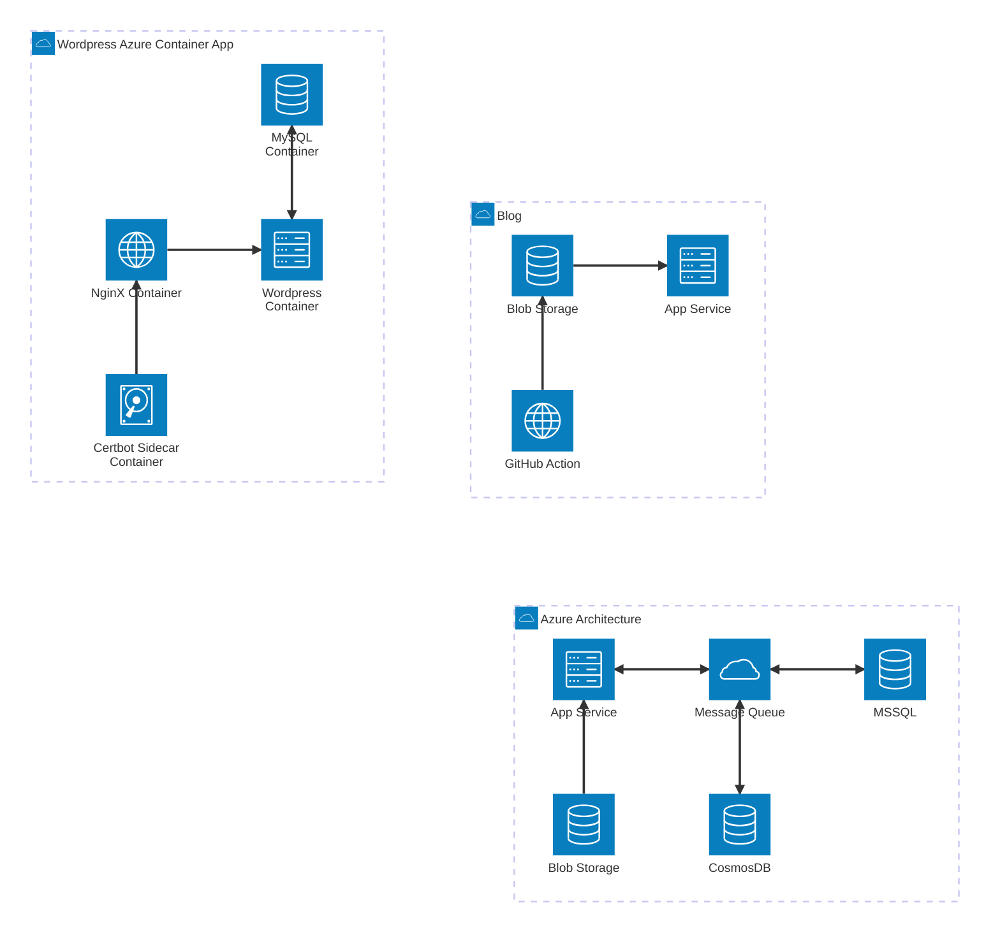

This is a simple demo of the blog features

# Markdown Header

- Supports markdown format e.g. lists
- Supports **bold**, italic, and __underscore__
- Supports markdown files, html, and typescript-rendered pages

## Accordions

<details class="accordion-item" open>
  <summary><strong>How does a Markdown accordion work?</strong></summary>

  <p>Wrap the expandable content in an HTML <code>&lt;details&gt;</code> element and use <code>&lt;summary&gt;</code> for its clickable label. The browser provides the expand and collapse behavior.</p>
</details>

<details class="accordion-item">
  <summary><strong>Can an accordion start expanded?</strong></summary>

  <p>Yes. Add the <code>open</code> attribute to the <code>&lt;details&gt;</code> element.</p>
</details>

<details class="accordion-item">
  <summary><strong>Does it need JavaScript?</strong></summary>

  <p>No. Native details elements work without JavaScript and support keyboard interaction.</p>
</details>

The code in the markdown file:
```html
<details>
  <summary>Click to expand</summary>

  <p>Content shown when expanded.</p>
</details>
```

## Persistent Checkboxes
- [ ] Todo item 1
- [ ] Todo item 2
- [ ] Todo item 3
- [ ] Todo item 4
- [ ] Todo item 5
  - [ ] Todo sub item 1
  - [ ] Todo sub item 2

## Code Blocks

Code block with line highlighting

```typescript line=4
const test = "hello";
console.log(test + " world");
// highlight the following line
console.info("this should be highlighted.");
const test2 = 5;
```

Code block with lines highlighted and offset
```typescript line=4-6 lineOffset=100
const test = "hello";
console.log(test + " world");
// highlight the following line
console.info("this should be highlighted.");
const test2 = 5;
const test3 = test + ", this is Johnny " + test2;
console.log("test", test3);
```

Code block from remote URL
```html source=https://raw.githubusercontent.com/jburditt/fullswing-angular-library/refs/heads/main/projects/fullswing-blog/src/app/app.html
```

## Mermaid Diagrams

